# Documentation Diagrams and Visual Aids

**Version**: 1.0.0  
**Last Updated**: 2026-02-07  
**Audience**: Documentation contributors and visual learners

> **Purpose**: Collection of diagrams, flowcharts, and visual aids to enhance understanding of ai_workflow_core. These diagrams use text-based formats (Mermaid, ASCII art, PlantUML) that render in GitHub and other markdown viewers.

---

## Table of Contents

- [Architecture Diagrams](#architecture-diagrams)
- [Integration Flow Diagrams](#integration-flow-diagrams)
- [Directory Structure Visualizations](#directory-structure-visualizations)
- [Workflow Diagrams](#workflow-diagrams)
- [CI/CD Pipeline Diagrams](#cicd-pipeline-diagrams)
- [Decision Trees](#decision-trees)
- [Sequence Diagrams](#sequence-diagrams)
- [How to Use These Diagrams](#how-to-use-these-diagrams)
- [Creating New Diagrams](#creating-new-diagrams)

---

## Architecture Diagrams

### System Overview

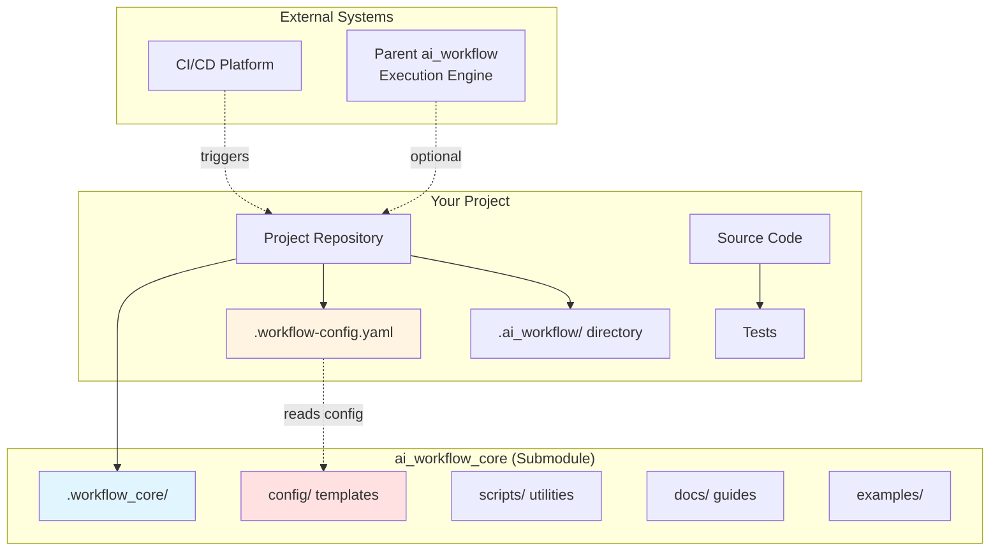

**Description**: Shows the relationship between your project, ai_workflow_core submodule, and external systems.

---

### Template System Architecture

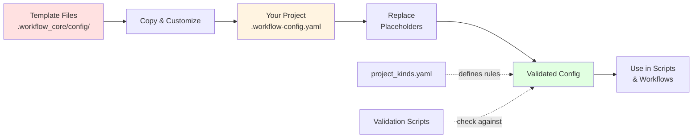

**Description**: Illustrates the template customization flow from ai_workflow_core to your project.

---

### Configuration Layer Model

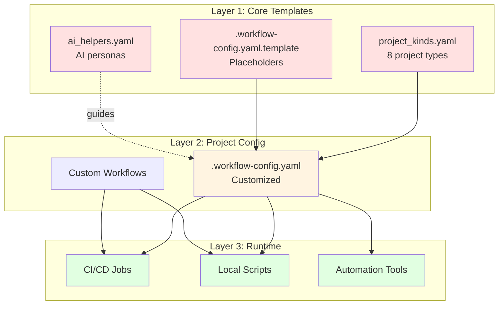

**Description**: Three-layer architecture showing how templates flow to runtime execution.

---

## Integration Flow Diagrams

### Initial Setup Flow

```mermaid
flowchart TD
    Start([Start]) --> A{Git repo<br/>initialized?}
    A -->|No| B[git init]
    A -->|Yes| C[Add submodule]
    B --> C
    C --> D[git submodule add<br/>ai_workflow_core]
    D --> E[Copy template]
    E --> F[cp .workflow-config.yaml.template<br/>.workflow-config.yaml]
    F --> G[Edit config]
    G --> H{All placeholders<br/>replaced?}
    H -->|No| I[Replace {{PLACEHOLDERS}}<br/>with actual values]
    I --> H
    H -->|Yes| J[Create artifact dirs]
    J --> K[mkdir -p .ai_workflow/...]
    K --> L[Update .gitignore]
    L --> M[Commit changes]
    M --> End([Setup Complete])
    
    style Start fill:#e1f5ff
    style End fill:#e1ffe1
    style H fill:#fff4e1
    style I fill:#ffe1e1
```

**Description**: Complete setup flow from initialization to commit.

---

### Configuration Flow

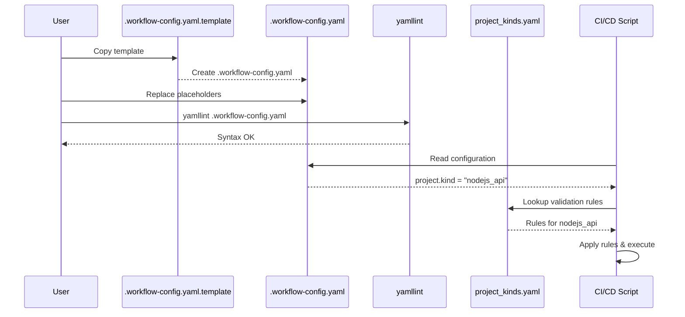

**Description**: Sequence of events from template to execution.

---

### Submodule Update Flow

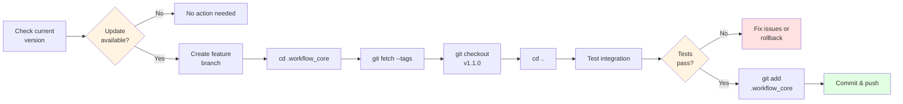

**Description**: Safe submodule update process with testing.

---

## Directory Structure Visualizations

### Standard Project Structure

```
project-root/
│
├── .workflow_core/              # 🔹 Git submodule
│   ├── config/                  # Template configurations
│   │   ├── .workflow-config.yaml.template
│   │   ├── project_kinds.yaml
│   │   └── ai_helpers.yaml
│   ├── scripts/                 # Utility script templates
│   ├── docs/                    # Documentation
│   └── examples/                # Integration examples
│
├── .ai_workflow/                # 🔸 Generated artifacts (gitignored)
│   ├── backlog/                 # Execution reports
│   ├── summaries/               # AI summaries
│   ├── logs/                    # Execution logs
│   ├── metrics/                 # Performance metrics
│   ├── checkpoints/             # Resume points
│   ├── prompts/                 # AI prompt logs (optional commit)
│   ├── ml_models/               # ML models (optional commit)
│   └── .incremental_cache/      # Incremental processing cache
│
├── .workflow-config.yaml        # 🔹 Customized config (committed)
├── .gitignore                   # Includes .ai_workflow/ patterns
├── .gitmodules                  # Submodule configuration
│
├── src/                         # Your source code
├── tests/                       # Your tests
├── docs/                        # Your documentation
└── README.md                    # Your project README
```

**Legend**:
- 🔹 **Blue** = Files to commit to Git
- 🔸 **Orange** = Generated files (usually gitignored)

---

### Multi-Language Project Structure

```
monorepo/
│
├── .workflow_core/              # Submodule (shared config)
├── .workflow-config.yaml        # Root configuration
│
├── backend/                     # 🐍 Python service
│   ├── src/
│   ├── tests/
│   └── requirements.txt
│
├── frontend/                    # ⚛️  React SPA
│   ├── src/
│   ├── tests/
│   └── package.json
│
├── api-gateway/                 # 🟢 Node.js gateway
│   ├── src/
│   ├── tests/
│   └── package.json
│
├── shared/                      # 📦 Shared code
│   ├── types/                   # TypeScript types
│   └── utils/                   # Utilities
│
└── .ai_workflow/                # Shared artifacts
    ├── logs/
    │   ├── backend/
    │   ├── frontend/
    │   └── api-gateway/
    └── metrics/
```

---

### Artifact Directory Deep Dive

```
.ai_workflow/
│
├── backlog/                     # 📋 Execution reports & dev artifacts
│   ├── session_20260207_143022.json
│   ├── task_analysis.md
│   └── feature_implementation.md
│
├── summaries/                   # 📝 AI-generated summaries
│   ├── daily_summary_20260207.md
│   └── weekly_summary_2026W06.md
│
├── logs/                        # 📊 Execution logs
│   ├── workflow_20260207_143022.log
│   ├── test_results.xml
│   └── build_20260207.log
│
├── metrics/                     # 📈 Performance metrics
│   ├── test_coverage.json
│   ├── build_time_series.json
│   └── deployment_metrics.json
│
├── checkpoints/                 # 💾 Resume points
│   ├── deploy_20260207_step3.json
│   └── migration_20260207_checkpoint.json
│
├── prompts/                     # 🤖 AI prompt logs (optional commit)
│   ├── doc_generation_prompts.json
│   └── test_generation_prompts.json
│
├── ml_models/                   # 🧠 ML models (optional commit)
│   ├── code_classifier_v1.pkl
│   └── test_generator_model/
│
└── .incremental_cache/          # ⚡ Incremental cache (gitignored)
    ├── file_hashes.json
    └── dependency_graph.json
```

---

## Workflow Diagrams

### Standard Development Workflow

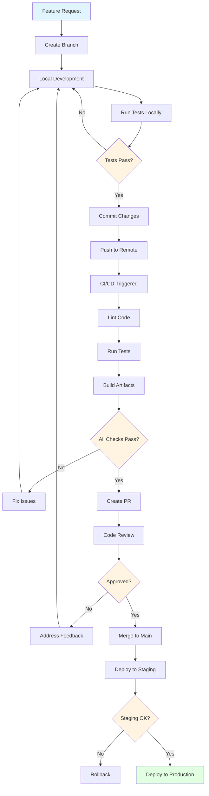

---

### Deployment Workflow

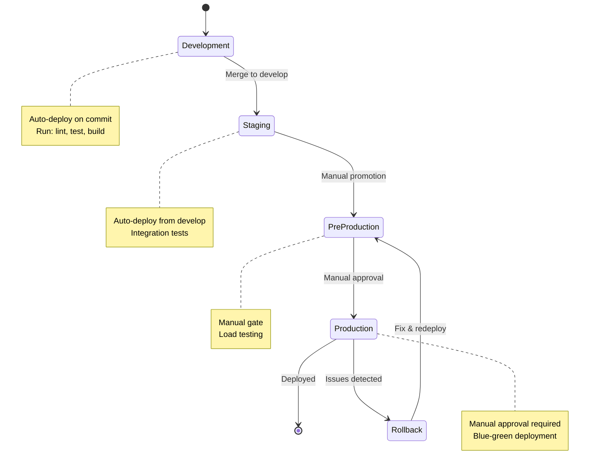

---

### Test Workflow Hierarchy

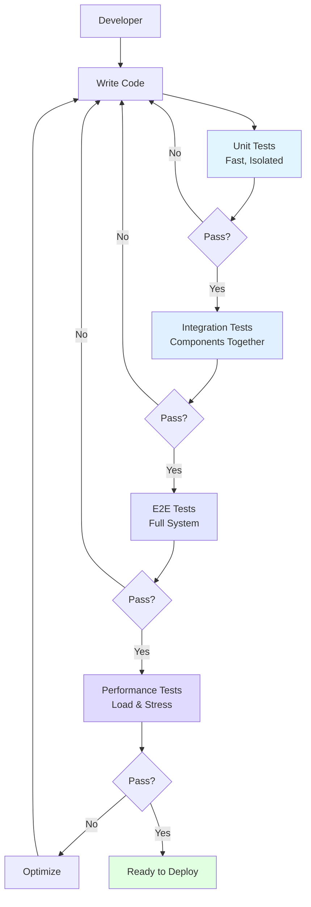

---

## CI/CD Pipeline Diagrams

### GitHub Actions Pipeline

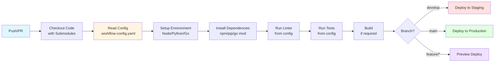

---

### Multi-Platform CI/CD

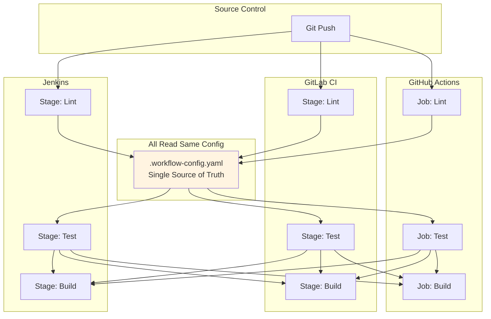

**Description**: How different CI/CD platforms use the same configuration.

---

## Decision Trees

### Choosing Project Kind

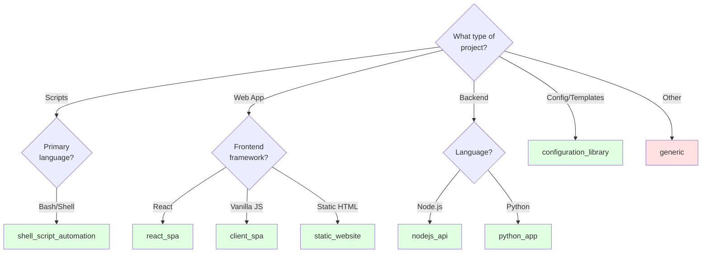

---

### Troubleshooting Decision Tree

```mermaid
graph TD
    A[Problem?] --> B{Type?}
    
    B -->|Submodule| C{.workflow_core<br/>empty?}
    C -->|Yes| D[git submodule<br/>update --init]
    C -->|No| E{Shows as<br/>modified?}
    E -->|Yes| F[git submodule<br/>update]
    
    B -->|Config| G{YAML<br/>error?}
    G -->|Yes| H[yamllint<br/>.workflow-config.yaml]
    G -->|No| I{Placeholders<br/>remain?}
    I -->|Yes| J[Replace all<br/>{{PLACEHOLDERS}}]
    
    B -->|Tests| K{Tests<br/>fail?}
    K -->|Yes| L[Check test_command<br/>in config]
    
    B -->|Deployment| M{Deploy<br/>fails?}
    M -->|Yes| N[Check credentials<br/>& permissions]
    
    style D fill:#e1ffe1
    style F fill:#e1ffe1
    style H fill:#e1ffe1
    style J fill:#e1ffe1
    style L fill:#e1ffe1
    style N fill:#e1ffe1
```

---

## Sequence Diagrams

### User Integration Sequence

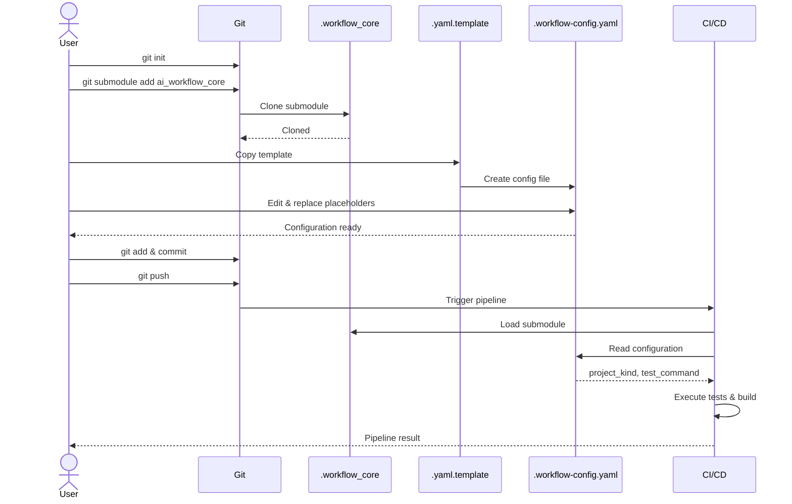

---

### Multi-Language Test Execution

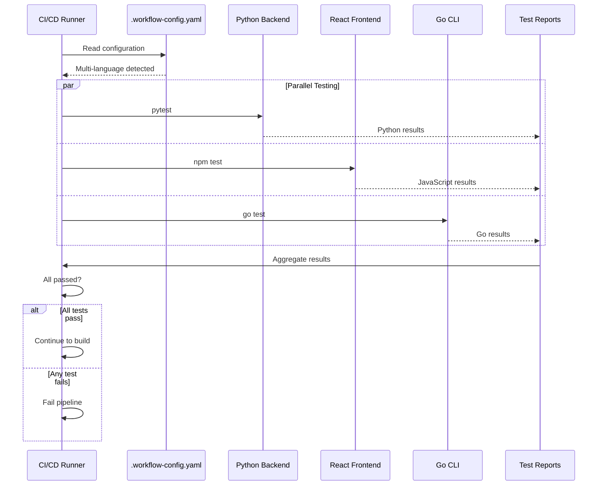

---

### Deployment Approval Flow

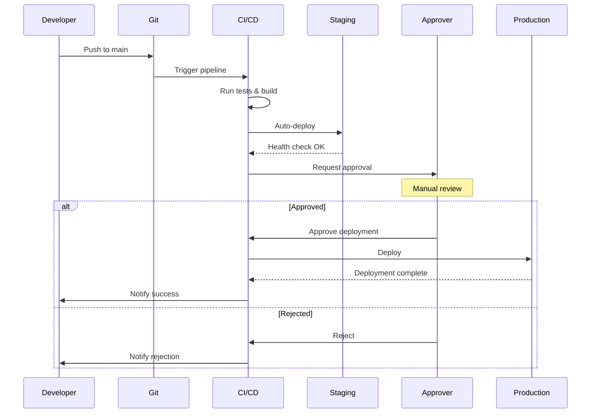

---

## How to Use These Diagrams

### In Documentation

**Include diagrams in markdown**:

````markdown
## Architecture

The following diagram shows the system architecture:

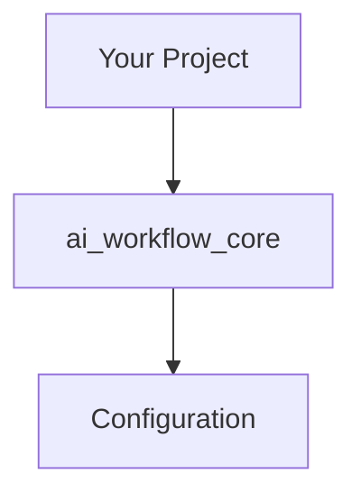
````

### Viewing Diagrams

**Platforms that render Mermaid**:
- ✅ GitHub (native support)
- ✅ GitLab (native support)
- ✅ VS Code (with Mermaid extension)
- ✅ Markdown Preview Enhanced
- ✅ Obsidian
- ✅ Notion

**Export as images**:
1. Use [Mermaid Live Editor](https://mermaid.live/)
2. Paste diagram code
3. Export as PNG/SVG

### In Presentations

**Convert to slides**:
```bash
# Using Marp
marp diagram.md -o diagram.pdf

# Using reveal.js
pandoc diagram.md -t revealjs -o diagram.html
```

---

## Creating New Diagrams

### Mermaid Syntax Basics

**Flowchart**:
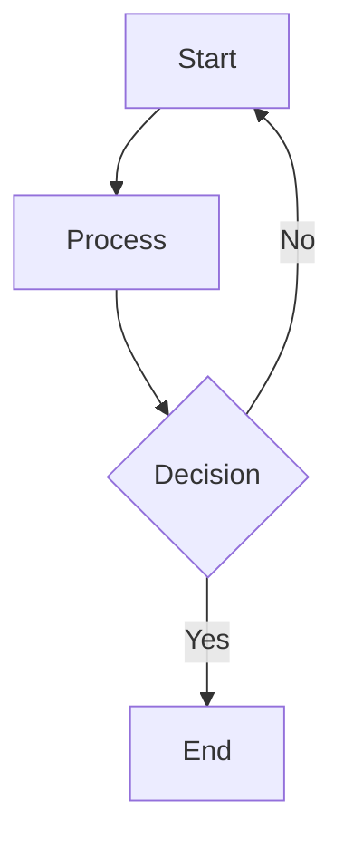

**Sequence Diagram**:
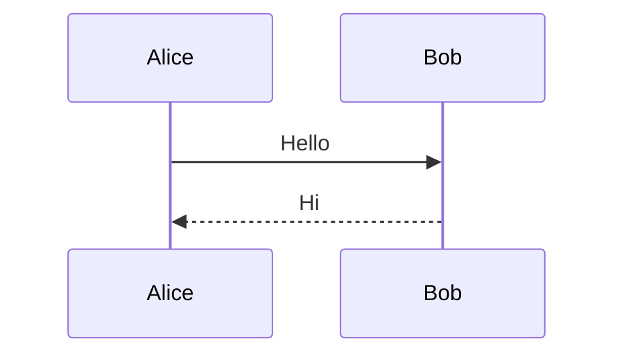

**State Diagram**:
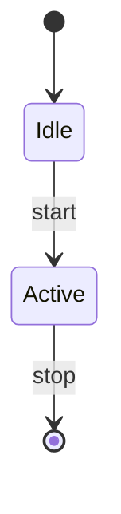

**Class Diagram**:
```mermaid
classDiagram
    class Project {
        +String name
        +String kind
        +test()
    }
```

---

### ASCII Art for Simple Diagrams

**Box and Arrow**:
```
┌─────────────┐
│   Project   │
└──────┬──────┘
       │
       ▼
┌─────────────┐
│   Config    │
└─────────────┘
```

**Tree Structure**:
```
project/
├── src/
│   ├── main.js
│   └── lib/
│       └── utils.js
└── tests/
    └── main.test.js
```

---

### PlantUML (Alternative to Mermaid)

**Component Diagram**:
```plantuml
@startuml
[Your Project] --> [ai_workflow_core]
[ai_workflow_core] --> [Configuration]
@enduml
```

**Use Case Diagram**:
```plantuml
@startuml
actor User
User --> (Setup Project)
User --> (Run Tests)
User --> (Deploy)
@enduml
```

---

### Tools for Creating Diagrams

**Online Tools**:
- [Mermaid Live Editor](https://mermaid.live/) - Mermaid diagrams
- [PlantUML Online](http://www.plantuml.com/plantuml/) - PlantUML diagrams
- [Excalidraw](https://excalidraw.com/) - Hand-drawn style
- [Draw.io](https://app.diagrams.net/) - General diagrams

**Command-line Tools**:
```bash
# Install mermaid-cli
npm install -g @mermaid-js/mermaid-cli

# Generate diagram
mmdc -i diagram.mmd -o diagram.png

# Install PlantUML
sudo apt install plantuml

# Generate diagram
plantuml diagram.puml
```

**VS Code Extensions**:
- Mermaid Preview
- PlantUML
- Markdown Preview Mermaid Support
- Draw.io Integration

---

## Diagram Best Practices

### 1. Keep It Simple
- ❌ Don't: Include every detail
- ✅ Do: Show key components and relationships
- ✅ Do: Create multiple simple diagrams vs one complex diagram

### 2. Use Consistent Styling
```mermaid
graph TD
    A[User Action]
    B[System Process]
    C[External System]
    D[Decision Point]
    
    style A fill:#e1f5ff
    style B fill:#fff4e1
    style C fill:#ffe1e1
    style D fill:#f0e1ff
```

**Color key**:
- 🔵 Blue: User actions
- 🟡 Yellow: System processes
- 🔴 Red: External systems
- 🟣 Purple: Decision points

### 3. Add Context
- Include diagram title
- Add legend when needed
- Provide description below diagram
- Explain non-obvious symbols

### 4. Make It Accessible
- Use text-based formats (Mermaid, PlantUML)
- Provide alt text for images
- Use high contrast colors
- Include text description for screen readers

### 5. Version Control
- Store diagrams as code (`.mmd`, `.puml` files)
- Track changes in Git
- Include generation date in comments
- Document diagram dependencies

---

## Contributing Diagrams

### Submission Guidelines

1. **Use text-based format** (Mermaid preferred)
2. **Place in `docs/diagrams/` directory**
3. **Follow naming convention**: `diagram-name.mmd` or `diagram-name.md`
4. **Include metadata**:
   ```markdown
   <!-- 
   Title: Architecture Overview
   Author: username
   Date: 2026-02-07
   Purpose: Show system components
   -->
   ```

5. **Update this index** with link to new diagram

### Diagram Checklist

- [ ] Diagram serves clear purpose
- [ ] Uses Mermaid or PlantUML syntax
- [ ] Renders correctly on GitHub
- [ ] Includes title and description
- [ ] Uses consistent styling
- [ ] Referenced in appropriate documentation
- [ ] Source code committed (`.mmd` file)

---

## Resources

### Documentation
- [Mermaid Documentation](https://mermaid.js.org/)
- [PlantUML Guide](https://plantuml.com/guide)
- [GitHub Mermaid Support](https://github.blog/2022-02-14-include-diagrams-markdown-files-mermaid/)

### Tools
- [Mermaid Live Editor](https://mermaid.live/)
- [PlantUML Online](http://www.plantuml.com/plantuml/)
- [Excalidraw](https://excalidraw.com/)
- [ASCII Flow](https://asciiflow.com/) - ASCII diagrams

### Examples
- **This document** - Various diagram types
- `docs/ARCHITECTURE.md` - Architecture diagrams
- `docs/INTEGRATION.md` - Integration flow diagrams

---

**Last Updated**: 2026-02-07  
**Document Version**: 1.0.0  
**Total Diagrams**: 20+ examples

